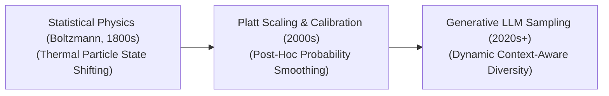

# Awesome-Temperature-Scaling
## Temperature Scaling: Evolution, Variants, Types, & Applications

Temperature Scaling is a post-processing and inference-time technique used to recalibrate the confidence scores of machine learning models or control the randomness of generative outputs. Mathematically, it introduces a single scalar parameter, Temperature ($T > 0$), to divide the unnormalized log-odds (logits) right before they enter a Softmax or Sigmoid activation layer. Crucially, Temperature Scaling alters the smoothness of the final output probability distribution *without* changing the relative ranking of the options or modifying the underlying parameters of the trained network.

---

## 1. The Chronological Evolution

The implementation of temperature-based logit manipulation has transitioned from early statistical physics modeling to strict model calibration layers and multi-scale generative decoding filters.

*   **The Statistical Physics Foundation (Boltzmann Distribution, 1800s)**
    *   *Concept:* Borrowed from thermodynamics. In physical systems, high temperature increases particle kinetic energy, distributing states evenly, while absolute zero freezes particles into a single lowest-energy state. 
    *   *Limitation:* Remained an abstract concept outside of computer science until it was adopted for Simulated Annealing and early Boltzmann machine setups in the late 20th century.
*   **The Post-Hoc Model Calibration Era (Guo et al., 2017)**
    *   *Concept:* Applied to modern deep neural networks to fix **miscalibration**. Modern deep networks are notoriously overconfident (e.g., predicting an output with 99% confidence that is only correct 75% of the time). Guo et al. revived Temperature Scaling as a simple, post-hoc optimization layer to align model confidence with empirical accuracy.
    *   *Significance:* Outperformed complex calibration variations because it optimizes a single scalar value using a validation dataset, preserving accuracy while making predictions trustworthy.
*   **The Generative Inference-Time Sampling Era (~2020–Present)**
    *   *Concept:* The standard runtime configuration dial across Large Language Models (LLMs) and Diffusion Generators. Instead of freezing confidence, it acts as a dynamic variance slider to scale output creativity, giving rise to modern dynamic boundaries like **Min-P** and **Entropy-Aware Scaling**.

---

## 2. Core Functional & Algorithmic Variants

Depending on whether Temperature Scaling is applied uniformly or mapped across separate parameter dimensions, the algorithm operates via distinct structural variants.

*   **Global Temperature Scaling (Standard Calibration)**
    *   *Mechanism:* A single, static scalar temperature value ($T$) is applied uniformly across all classes and all data tensors within a layer: $\hat{p}_i = \max_i \text{Softmax}(z_i / T)$.
    *   *Pros:* Extremely lightweight; it does not change the argmax prediction or corrupt the learned decision boundaries of the model.
*   **Vector Scaling**
    *   *Mechanism:* Extends standard temperature scaling by assigning a unique, independent temperature parameter $T_i$ and an individual bias term $b_i$ to each class linearly.
    *   *Cons:* Can inadvertently alter the model's final argmax class prediction if the validation scaling factors conflict with the base weights.
*   **Matrix Scaling**
    *   *Mechanism:* Converts the scaling layer into a full linear transformation ($Wz + b$) applied straight to the logit vector.
    *   *Cons:* Suffers from parameter explosion if the vocabulary or class count is massive, risking severe overfitting on validation data.

---

## 3. Generative Inference Decoding Types

At inference time in autoregressive generation models, the selection of the temperature parameter value dictates the balance between structural determinism and creative token diversity.

*   **Low Temperature ($T \rightarrow 0$) / Greedy Decoding**
    *   *Behavior:* The largest logit is amplified relative to the rest, compressing the probability space until the highest-scoring token achieves nearly 1.0 probability.
    *   *Downstream Output:* Highly deterministic, repetitive, and rigid. Ideal for structural, closed-box logic tasks like writing python code, evaluating math formulas, or parsing database tables.
*   **Neutral Temperature ($T = 1.0$)**
    *   *Behavior:* Leaves the output logs completely unaltered, passing the exact raw, uncalibrated mathematical distribution generated by the base transformer layers to the sampling engine.
*   **High Temperature ($T > 1.0$)**
    *   *Behavior:* Flattens out the probability peaks, closing the numerical gap between highly likely tokens and rare, long-tail tokens.
    *   *Downstream Output:* Highly creative, diverse, and fluid, but increasingly susceptible to sudden semantic degradation, grammatical breakdowns, and absolute factual hallucinations as $T \rightarrow \infty$.

---

## 4. Modern Dynamic & Context-Aware Implementations

Static temperature configurations often fail when a model transitions between straightforward prompt matching and abstract, multi-step logical reasoning. Modern platforms utilize adaptive setups.

*   **Dynamic Temperature Decay (Annealing)**
    *   *Mechanism:* Initiates token generation with a high temperature to discover creative structural headings, and systematically decays the value down toward a low, deterministic threshold as the token sequence approaches termination.
*   **Min-P Sampling Integration**
    *   *Mechanism:* Evaluates the absolute probability of the top token first, and drops all long-tail tokens whose scaled probabilities fall below a dynamic fraction of that maximum peak before temperature rotation occurs.
    *   *Pros:* Automatically cleans up high-temperature hallucinations without truncating valuable alternative paths during creative generation blocks.
*   **Entropy-Bounded Scaling (Reasoning Optimization)**
    *   *Mechanism:* Tracks the mathematical *Entropy* of the logit pool at each token step. If entropy is low (the model is highly certain), temperature stays low. If entropy spikes (the model encounters a complex logical fork), temperature is scaled up dynamically to permit alternative hypothesis pathways.

---

## 5. Production Engineering Challenges & Mitigations

*   **The Expected Calibration Error (ECE) Bottleneck**
    *   *The Problem:* Evaluating whether a model is accurately calibrated requires measuring its **ECE** across a distinct validation dataset. If the calibration dataset exhibits a massive distribution shift compared to live production prompts, the optimized temperature value will actively degrade model trustworthiness.
    *   *Mitigation:* Running continuous, automated ECE monitoring loops over incoming production logs, updating the scalar temperature via moving averages to handle evolving user traffic distributions.
*   **The Softmax Overflow / Division-by-Zero Bug**
    *   *The Problem:* If a user or an automated agent sets the temperature parameter to absolute zero ($T = 0$), calculating $z_i / 0$ triggers an uncatchable system math error or NaN (Not-a-Number) crash inside the GPU kernel block.
    *   *Mitigation:* Hardcoding a strict lower parameter boundary within the inference serving framework (e.g., catching $T \le 0$ and automatically routing the execution graph to a specialized, zero-overhead `argmax` processing pipeline instead).

---

## 6. Real-World Deep Learning Applications

*   **Autoregressive LLM Inference Engines (vLLM / Hugging Face)**
    *   *Application:* Acts as the primary user-facing configuration parameter in chat interfaces. It allows enterprise applications to tune a single model model dynamically—using low temperatures for billing customer support bots and high temperatures for creative marketing copywriters.
*   **Safety Critical Clinical Medical Risk Predictors**
    *   *Application:* Deep learning networks predicting patient mortality or ICU survival curves utilize Temperature Scaling to ensure that a predicted "80% chance of a cardiovascular event" maps exactly to an empirical 80% outcome rate, preventing dangerous diagnostic misclassifications.
*   **Autonomous Driving Perception Object Classifiers**
    *   *Application:* Normalizes confidence boundaries for computer vision networks tracking roadside obstacles. Precise calibration ensures that the vehicle's internal routing engine can reliably evaluate safety thresholds when dealing with blurry, low-confidence objects under severe weather glare.

